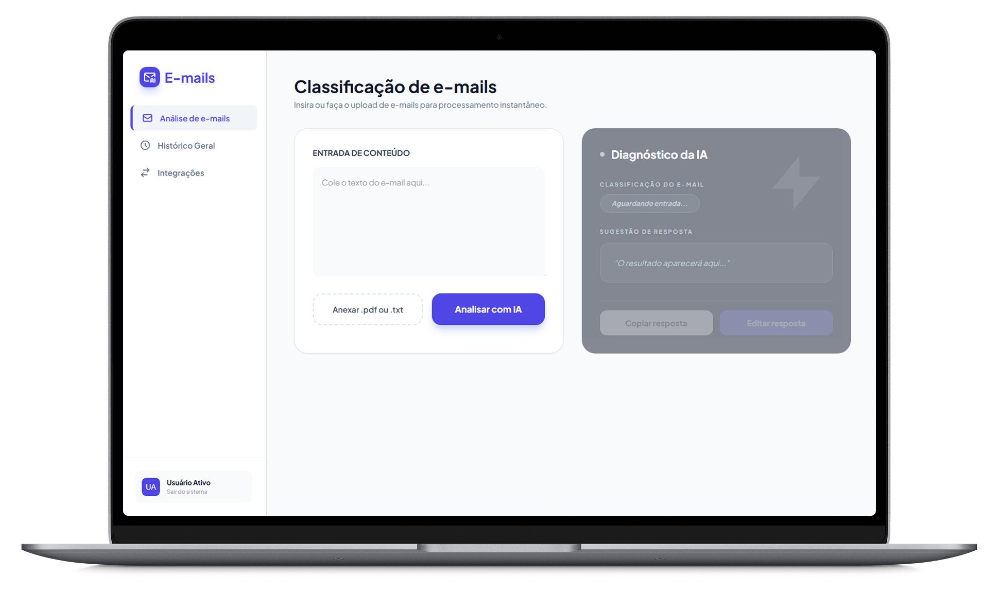

# AI Email Classifier

O **AI Email Classifier** é uma solução inteligente para triagem de e-mails. Utilizando a API da **Groq**, a aplicação analisa o conteúdo de e-mails, classifica-os entre **Produtivo** ou **Improdutivo**, e sugere uma resposta formal automática.

---

## Landing Page - Preview



- Projeto online - **[Vercel](https://ia-email-classifier.vercel.app/)**
- Observação: A aplicação usa sessionStorage para simular um banco de dados. Ao encerrar a sessão, os dados analisados serão perdidos.  

## Tecnologias Utilizadas

- **Backend**: [FastAPI](https://fastapi.tiangolo.com/) (Python)
- **IA**: [Groq Cloud](https://console.groq.com/) (Modelo Llama 3.3 70b)
- **Frontend**: HTML5, JavaScript (ES6+), [Tailwind CSS](https://tailwindcss.com/)

---

## Estrutura de Pastas

```text
├── api/
│   └── main.py          # Servidor FastAPI e integração com Groq
├── static/              # Arquivos estáticos servidos pela API
│   ├── css/
│   │   └── style.css    # Estilização do frontend
│   └── js/
│       └── script.js    # Lógica e chamadas de API
├── templates/
│   └── index.html       # Interface principal (SPA)
└── requirements.txt     # Dependências do projeto
```

---

## Instalação e Execução Local

Siga os passos abaixo para rodar o projeto em sua máquina:

### 1. Clone o Repositório
```bash
git clone https://github.com/mateusdmc/ia-email-classifier.git
```

### 2. Acesse o diretório do projeto 
```bash
cd ia-email-classifier
```

### 3. Configure o Ambiente Virtual
```bash
# Criar o ambiente
python -m venv venv

# Ativando o ambiente

# -> No Windows:
venv\Scripts\activate

# -> No Linux/Mac:
source venv/bin/activate
```

### 4. Instale as Dependências
```bash
pip install -r requirements.txt
```

### 5. Inicie o Servidor
```bash
# Navegue até a pasta onde está o arquivo principal
cd api
```

### 6. Configure a chave da API Groq
```bash
# -> No Windows (Prompt de Comando - CMD)
set GROQ_API_KEY=SUA_CHAVE_AQUI

# Em seguida
python main.py

# OU

# -> No Linux / Mac:
export GROQ_API_KEY="SUA_CHAVE_AQUI"

# Em seguida
python main.py
```

### 7. Acessar a Aplicação
```bash
Aplicação servida em: http://localhost:8000/
```
